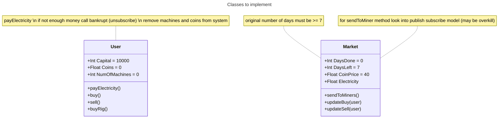

# TKU project
## Part 1: Simulation game for crypto SDPACoin

```mermaid
 ---
title: Classes to implement
---
classDiagram
    note for User "payElectricity \n if not enough money call bankrupt (unsubscribe) \n remove machines and coins from system"
    note for Market "original number of days must be >= 7"
    note for Market "for sendToMiner method look into publish subscribe model (may be overkill)"
    class User{
        +Int Capital = 10000
        +Float Coins = 0
        +Int NumOfMachines = 0
        +payElectricity()
        +buy()
        +sell()
        +buyRig()
    }

    class Market{
        +Int DaysDone = 0
        +Int DaysLeft = 7
        +Float CoinPrice = 40
        +Float Electricity
        +sendToMiners()
        +updateBuy(user)
        +updateSell(user)
    }
   
```
