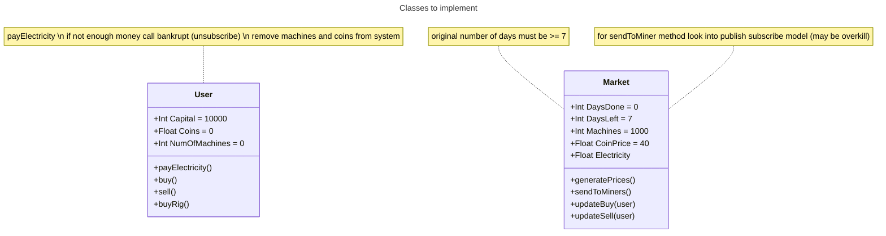

# TKU project
## Part 1: Simulation game for crypto SDPACoin

### Calling the Objects
- ask for number of users and number of days
- instantiate user class for number of users
- subscribe all users to the Market object 
- enter loop of days
  - call generatePrices(), this should update the CoinPrice and Electricity values using N(0.003, 0.0016)^3 and U(1.9, 2.1) to find the values
  - call sendToMiners(), this should distribute coin to miners going off the ratio User(NumOfMachines)/Market(Machines)
  - all miners payElectricity() functions are called (this could maybe be triggered throught eh sendToMiners() method)
  - ask for action; buy rig, buy coin, sell coin, nothing (this should call the update methods to ensure it is recorded)
 - at the end of the simulation print the results
