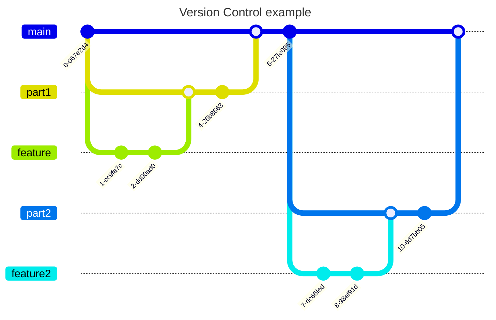

# TKU project
## How you should structure your version control

the basic idea of version control is that your main branch should be working the whole time. What I would suggest is branch off main for the first part of the coursework then branch of that for each feature (such as creating the User class), when it works merge into part1 branch then do next feature etc, when part1 is done merge it to main then repeat with the next part

## Part 1: Simulation game for crypto SDPACoin

### Calling the Objects
- ask for number of users and number of days
- instantiate user class for number of users
- subscribe all users to the Market object 
- enter loop of days
  - call generatePrices(), this should update the CoinPrice and Electricity values using N(0.003, 0.0016)^3 and U(1.9, 2.1) to find the values
  - call sendToMiners(), this should distribute coin to miners going off the ratio User(NumOfMachines)/Market(Machines)
  - all miners payElectricity() functions are called (this could maybe be triggered throught the sendToMiners() method)
  - ask for action; buy rig, buy coin, sell coin, nothing (this should call the update methods to ensure it is recorded)
 - at the end of the simulation print the results
